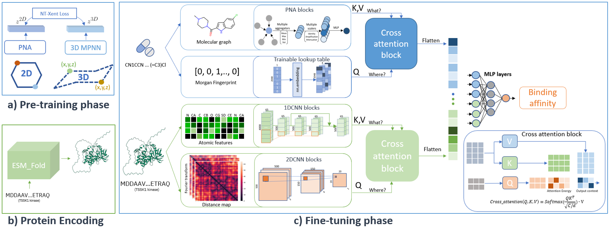
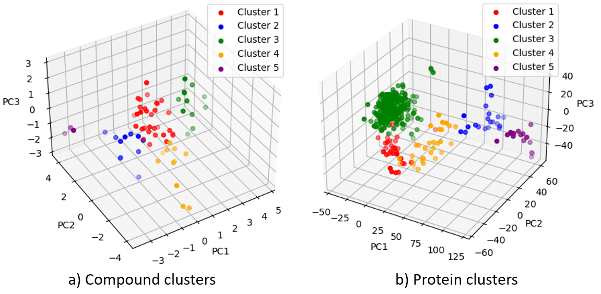
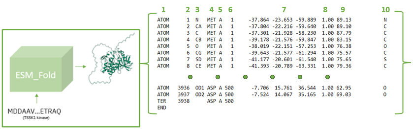

# MulinforCPI

A PyTorch Implementation of Paper:

**[MulinforCPI: enhancing precision of compound-protein interaction prediction through novel perspectives on multi-level information integration](https://academic.oup.com/bib/article/25/1/bbad484/7510975)**

Our repository uses 3DInformax from https://github.com/HannesStark/3DInfomax as a backbone for pretraining PNA for compound information extraction and ESM_Fold from https://github.com/facebookresearch/esm for predicting protein fold.

Forecasting the interaction between compounds and proteins is crucial for discovering new drugs. However, previous sequence-based studies have not utilized three-dimensional (3D) information on compounds and proteins, such as atom coordinates and distance matrices, to predict binding affinity. Furthermore, numerous widely adopted computational techniques have relied on sequences of amino acid characters for protein representations. This approach may constrain the model's ability to capture meaningful biochemical features, impeding a more comprehensive understanding of the underlying proteins. Here, we propose a two-step deep learning strategy named MulinforCPI that incorporates transfer learning techniques with multi-level resolution features to overcome these limitations. Our approach leverages 3D information from both proteins and compounds and acquires a profound understanding of the atomic-level features of proteins. Besides, our research highlights the divide between first-principle and data-driven methods, offering new research prospects for compound protein interaction tasks. We applied the proposed method to six datasets: Davis, Metz, KIBA, CASF-2016, DUD-E, and BindingDB, to evaluate the effectiveness of our approach.

## **Clustering the dataset:**
In our experiment we use cross, we used the cross-cluster validation technique. Leave one out for testing while the validation set is randomly taken from training set with the ratio 20/80. 
  `data_file: The file contains dataset (Davis,KIBA,metz)` 
  `output_folder: The folder contains five clusters` 
  ~~~
  python prepare_cluster_data_2023 #data_file #output_folder
  ~~~

## **To train MultinforCPI model:**

Set up the environment:
In our experiment we use, Python 3.7 with PyTorch 1.12.1 + CUDA 11.7.
~~~
git clone https://github.com/dmis-lab/MulinforCPI.git
conda env create -f environment.yml
~~~
Your data should be in the format .csv, and the column names are: 'smiles', 'sequence', 'label'.
1. Generate the 3D fold of protein from the dataset. 
`data_folder: Folder of dataset` 
  ~~~
  python generate_protein_fold.py #data_folder
  ~~~

The output of ESM fold. The 3D fold contains 1) The Card, 2) Atom Number, 3) Atom Type, 4) Three-Letter Amino Acid Code, 5) Chain ID, 6) Residue Number, 7) Atom Coordinates, 8) Atom Occupancy, 9) Atomic Displacement Parameter, 10) Element.

2. Calculate the Alpha Carbon distances. 
`input_folder: Output folder from ESM prediction.(Output of step 1.)` 
`output_folder: Folder of processed file` 
`data_name: Name of dataset` 
  ~~~
  python generate_distance_map.py #input_folder #output_folder #data_name
  ~~~

  3. Align the training dataset following the output of ESM fold. (FOR data-making purposes) 
`data_folder: Folder of Training dataset`  
`output_folder: Folder of processed file`  
`prot_dict: _data.csvdic.csv file in output folder of ESM prediction.` 
  ~~~
  python match_protein_index_esm.py #data_folder #output_folder #prot_dict
  ~~~

4. Generate the pickle .pt file for training  
`data name: Folder of Training dataset`  
`data_path: Aligned dataset (Output of step 3.)`  
`output_folder: Folder of Training dataset`  
`distance metric pt file: Alpha Carbon distances. ( Output of step 2.)`  
`esm prediction folder: Output folder from ESM prediction. (Output of step 1.)`  

  ~~~
  python create_train_cuscpidata_ecfp.py #data_name #data_path #output_folder #distance_metric_pdb_file #esm_prediction_folder 
  ~~~
5. Train the model  
 Change the `data_path: the processed data folder in .pt format ( Output of step 4.)` in `best_configs/tune_cus_cpi.yml`   
 To save time and result reimplementation please down load the pre-trained file:
 Download _runs_ files: https://github.com/HannesStark/3DInfomax/tree/master/runs/PNA_qmugs_NTXentMultiplePositives_620000_123_25-08_09-19-52  
  ~~~
  python train_cuscpi.py --config best_configs/tune_cus_cpi.yml
  ~~~
## **Dataset:**
The related links are as follows:  

KIBA, Davis:https://github.com/kexinhuang12345/DeepPurpose  
Metz: https://github.com/sirimullalab/KinasepKipred  
BindingDB: https://github.com/IBM/InterpretableDTIP  
DUD-E Diverse: http://dude.docking.org/subsets/diverse  
QMugs: https://libdrive.ethz.ch/index.php/s/X5vOBNSITAG5vzM  
CASF-2016: http://www.pdbbind.org.cn/casf.php  

## **To take inference:**
  Change the `test_data_path` and `checkpoint` in best_configs/inference_cpi.yml to take the inference (with `test_data_path` in made following step 1-2-3)  
  ~~~
  python inferencecpi.py --config=best_configs/inference_cpi.yml
  ~~~
## **Citation:**
If you find the models useful in your research, please consider citing the paper:
~~~
@article{nguyen20233dinforcpi,
  title={3DinforCPI: Enhancing Efficiency of Compound-Protein Interaction Prediction Through Novel Perspectives on Multi-level Information Integration},
  author={Nguyen, Ngoc-Quang and Park, Sejeong and Gim, Mogan and Kang, Jaewoo},
  year={2023}
}
~~~

## License
[MIT](https://choosealicense.com/licenses/mit/)
